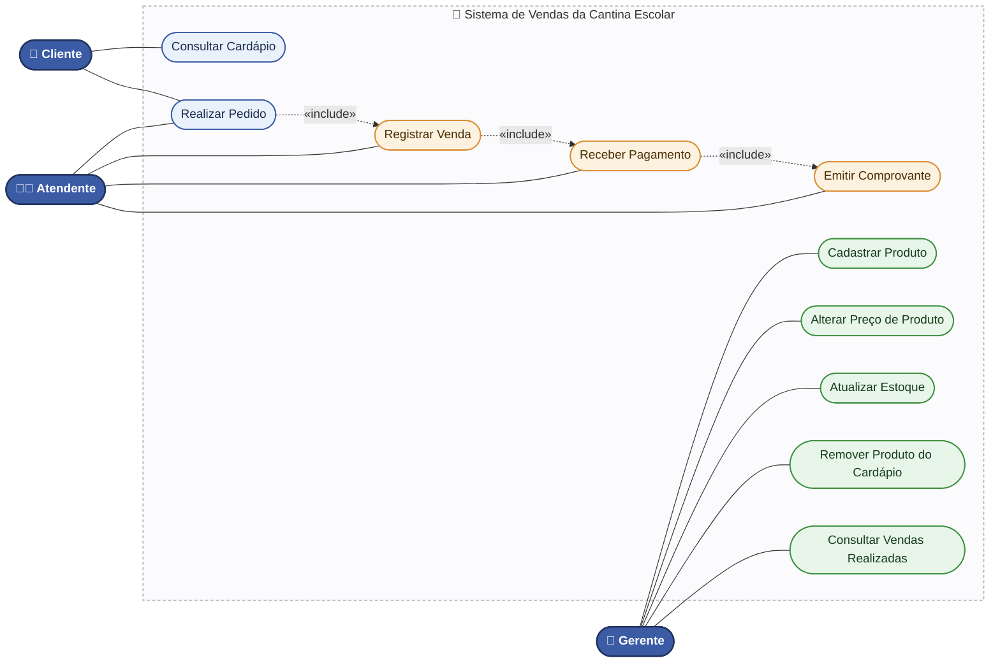
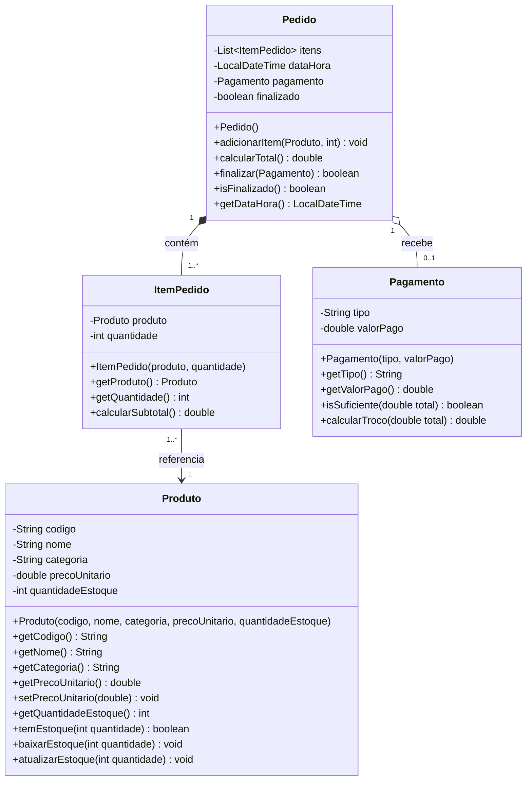

# Sistema de Vendas da Cantina Escolar

## Tarefa 1 – Casos de Uso

### 1. Atores do Sistema

- **Cliente** — escolhe produtos, monta o pedido e efetua o pagamento.
- **Atendente** — registra a venda, recebe o pagamento e emite o comprovante.
- **Gerente** — cadastra produtos, altera preços, atualiza estoques e consulta vendas.

### 2. Lista de Casos de Uso

| # | Caso de Uso | Ator(es) |
|---|---|---|
| 1 | Consultar Cardápio | Cliente |
| 2 | Realizar Pedido | Cliente, Atendente |
| 3 | Registrar Venda | Atendente |
| 4 | Receber Pagamento | Atendente |
| 5 | Emitir Comprovante | Atendente |
| 6 | Cadastrar Produto | Gerente |
| 7 | Alterar Preço de Produto | Gerente |
| 8 | Atualizar Estoque | Gerente |
| 9 | Remover Produto do Cardápio | Gerente |
| 10 | Consultar Vendas Realizadas | Gerente |

### 3. Diagrama de Casos de Uso

O Mermaid não possui um tipo nativo de "diagrama de casos de uso" (UML use case), então ele é representado com a notação de fluxograma (`flowchart`), seguindo a convenção usual: atores como bonecos/círculos, casos de uso como elipses dentro do retângulo do sistema, e relações `<<include>>` tracejadas entre casos de uso relacionados.

**Leitura do diagrama:**
- 🔵 **Cliente** (azul) — consulta o cardápio e participa da realização do pedido.
- 🟠 **Atendente** (laranja) — conduz a realização do pedido, que **inclui obrigatoriamente** registrar a venda, receber o pagamento e emitir o comprovante (setas tracejadas `«include»`).
- 🟢 **Gerente** (verde) — cuida da gestão do cardápio e do estoque, além de consultar as vendas realizadas.

---

### 4. Descrição Textual dos Casos de Uso

#### UC01 – Realizar Pedido

**Objetivo:** Permitir que o cliente escolha produtos do cardápio, monte um pedido, efetue o pagamento e receba o comprovante da compra.

**Atores:** Cliente (principal), Atendente (secundário)

**Fluxo Principal:**
1. O cliente consulta o cardápio disponível.
2. O cliente escolhe os produtos desejados e informa as quantidades.
3. O atendente registra cada item (produto + quantidade) no pedido.
4. O sistema calcula o subtotal de cada item e o valor total do pedido.
5. O atendente informa o valor total ao cliente.
6. O cliente escolhe a forma de pagamento (dinheiro, PIX ou cartão) e efetua o pagamento.
7. O atendente registra o pagamento no sistema.
8. O sistema verifica se o valor pago é suficiente para cobrir o total.
9. O sistema finaliza o pedido, dá baixa no estoque dos produtos vendidos e registra a data e hora da venda.
10. O sistema emite o comprovante da venda.

**Fluxo Alternativo A – Estoque Insuficiente:**
- No passo 3, se algum produto escolhido não tiver estoque suficiente para a quantidade solicitada, o sistema impede a inclusão do item e informa o atendente, que deve ajustar a quantidade ou remover o produto do pedido.

**Fluxo Alternativo B – Pagamento Insuficiente:**
- No passo 8, se o valor pago for menor que o total do pedido, o sistema não finaliza a venda e informa que o pagamento é insuficiente. O atendente solicita ao cliente um complemento de pagamento ou cancela o pedido.

---

#### UC02 – Cadastrar Produto

**Objetivo:** Permitir que o gerente inclua um novo produto no cardápio da cantina.

**Atores:** Gerente (principal)

**Fluxo Principal:**
1. O gerente acessa a opção de cadastro de produto.
2. O gerente informa código, nome, categoria, preço unitário e quantidade em estoque do novo produto.
3. O sistema verifica se já existe um produto cadastrado com o mesmo código.
4. O sistema cadastra o produto e o disponibiliza no cardápio.

**Fluxo Alternativo A – Código Duplicado:**
- No passo 3, se já existir um produto com o mesmo código, o sistema rejeita o cadastro e solicita que o gerente informe um código diferente.

---

## Tarefa 2 – Diagrama de Classes

O diagrama foi elaborado em **Mermaid** (renderiza automaticamente no GitHub). Também é possível abrir o mesmo código em [mermaid.live](https://mermaid.live) ou em qualquer editor compatível.

### Justificativa dos Relacionamentos

- **Pedido *— ItemPedido (composição, 1 : 1..*):** um `ItemPedido` não existe sem um `Pedido`; ao excluir o pedido, seus itens deixam de existir.
- **ItemPedido --> Produto (associação, 1..* : 1):** um `ItemPedido` referencia um `Produto`, mas o produto existe de forma independente do pedido (continua no cardápio mesmo sem ser vendido).
- **Pedido o— Pagamento (agregação, 1 : 0..1):** um pedido pode existir sem pagamento (antes de ser finalizado) e passa a "possuir" um pagamento quando a venda é concluída.
- O **tipo de pagamento** (dinheiro, PIX, cartão de crédito ou débito) é guardado como um simples texto (`String`) dentro de `Pagamento`, sem precisar de uma classe ou enumeração separada.
